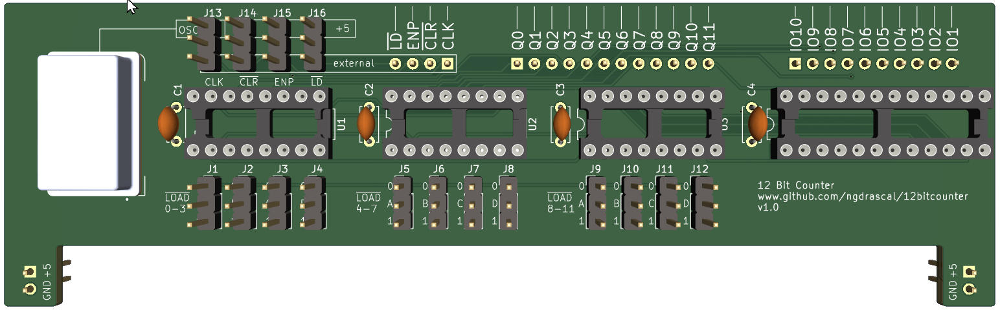
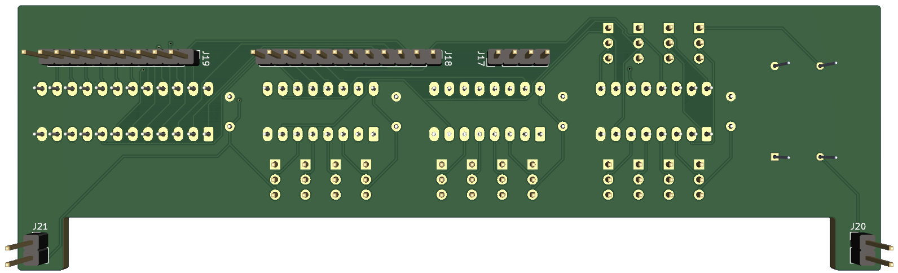
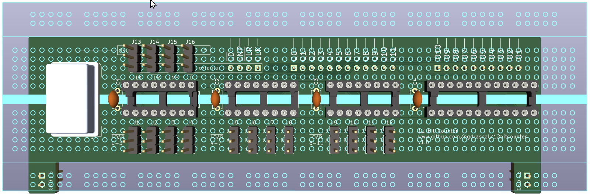

# A configurable 12 Bit Configurable Counter

<Figure>
    
    <figcaption>Figure 1: Board top</figcaption>
</figure>

<Figure>
    
    <figcaption>Figure 2: Board bottom</figcaption>
</figure>

<Figure>
    
    <figcaption>Figure 3: Breadboard</figcaption>
</figure>